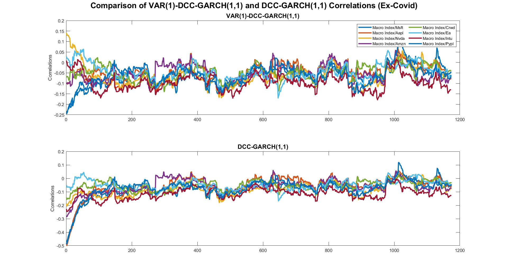
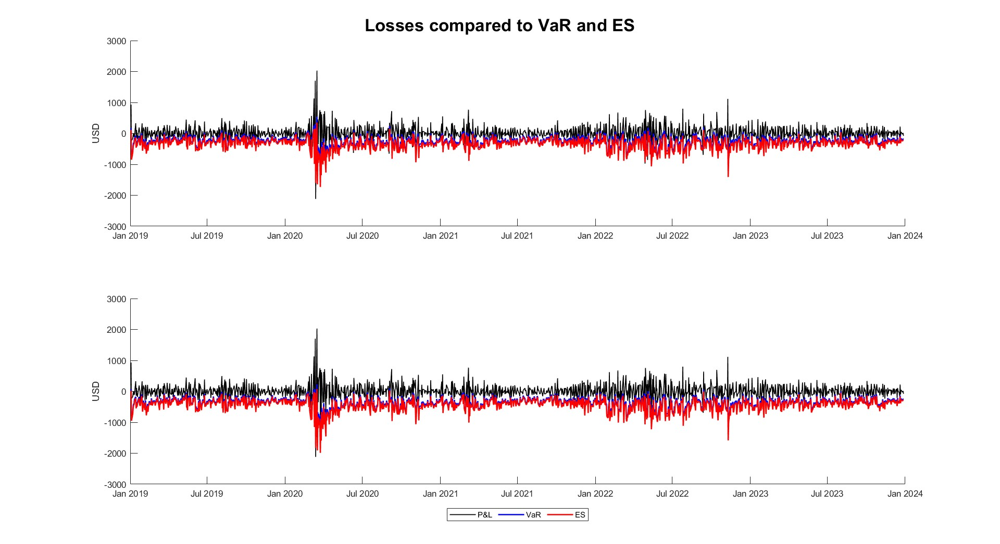
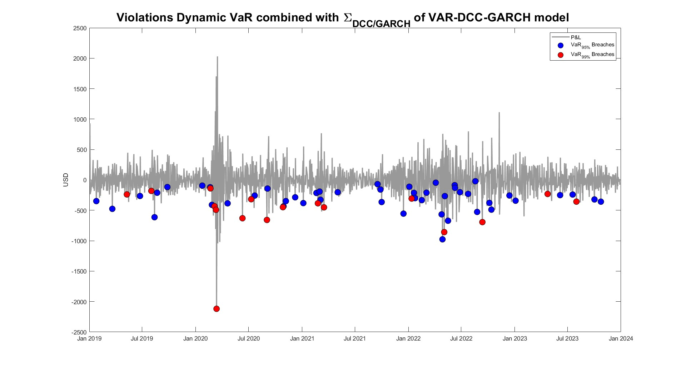
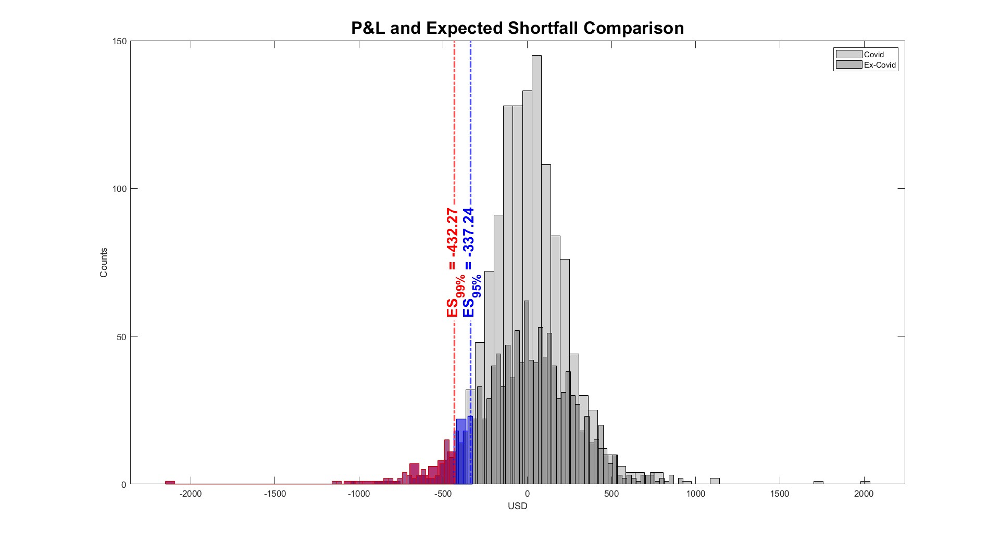

# Dynamic Correlation for Risk Assessment in Finance
This repository contains a **multivariate econometric study** that has been applied to the financial risk management of an equally weighted (EW) portfolio.

Starting with a set of securities selected through a _machine learning_ (ML) technique and an aggregated macroeconomic-financial index, the study examines the _evolution of the pairwise correlations_ between the purpose-built index and each security over a 5-year horizon (2019-2024), and applies the final results to estimate the _Value at Risk_ (VaR) and the _Expected Shortfall_ (ES) of an EW portfolio.

In addition, the research is carried out on the same dataset, but excluding the most turbulent months of the COVID-19 pandemic (_Feb-Apr 2020_) in order to analyse _differences_ in both econometric and risk management results.


## Repository Structure
The repository is organized into two main directories:
- `code/`, which contains all the scripts used for data processing,clustering, econometric modelling and portfolio risk estimation;
- `docs/`, which includes the full thesis and its supporting presentation.

The structure is shown below:
```
.
├── 01_clustering_and_macro_index/
│ ├── cluster_analysis.py             # Clustering of NASDAQ-100 using KMeans
│ ├── macro_financial_index.m         # Macro-financial index with GARCH(1,1) weights
│ └── macro_index_README.md
│ └── README.md
│
├── 02_dcc_garch_models/
│ ├── dcc_main_driver.m               # Master script for DCC/VAR pipeline
│ ├── dcc_compute_rolling.m           # Rolling correlation benchmark
│ ├── dcc_estimate_all_models.m       # DCC, GJR, TARCH, ADCC variants
│ ├── dcc_model_selection.m           # RMSE-based model selection
│ ├── dcc_compare_with_VAR.m          # VAR-DCC implementation + LRT
│ ├── dcc_generate_plots.m            # Generates all plots
│ └── README.md
│
├── 03_advanced_risk_management/
│ ├── EW_portfolio.m                  # Portfolio P&L based on equal weights
│ ├── VaR_ES.m                        # Dynamic VaR and ES estimation
│ ├── VaR_ES_breaches.m               # VaR and ES exceedance visualization
│ └── README.md
│
├── docs/
├── MSc_Thesis_Giovanni_Pedone.pdf
├── Presentation_Dissertation.pdf
│
└── README.md                         # This file
```
**_Note:_** each main subdirectory (e.g., `01_clustering_and_macro_index`, `02_dcc_garch_models`, `03_advanced_risk_management`)
contains an `images/` and `images_ex_covid/` folders that store the plots generated within that specific study section.


## How to Run

### Requirements
- **Python 3.11** (or later recommended)
  - [Anaconda](https://www.anaconda.com/) (recommended for package management)  
  - IDE: Spyder (used in development)  
- **MATLAB R2023a** (or later recommended)
  - Econometrics Toolbox
  - Statistics and Machine Learning Toolbox
  - Financial Toolbox
  - **MFE Toolbox by Kevin Sheppard** (for `dcc.m`)  
    → [MFE Toolbox - dcc.m](https://github.com/bashtage/mfe-toolbox/blob/main/multivariate/dcc.m), _make sure to add the toolbox to the MATLAB path before running any script_


## Main Outputs
The repository produces key outputs based on econometric modelling and dynamic risk analysis. Results are presented from two perspectives:

**1. Econometric Insights (DCC-GARCH vs. VAR-DCC-GARCH)**

The dynamic conditional correlations estimated through the DCC(1,1) and VAR(1)-DCC(1,1) models show substantial convergence over time. Excluding the most volatile months of the Covid-19 pandemic (Feb–Apr 2020) appears to:
- **_improve the overall stability of correlations_**, with smoother transitions and fewer spikes;
- **_reduce frequent regime shifts_** between positive and negative relationships;
- allow for **_more accurate modelling_** of second-order conditional moments.

<p align="center">
  
  <br>
  
</p>

Even in the absence of exogenous shocks, the trends across models remain largely overlapping, but _Ex-COVID_ data displays less noisy dynamics and more consistent correlation patterns.

**2. Risk Measures: VaR and ES (COVID vs. Ex-COVID)**

The model provides a set of outputs illustrating the dynamic estimation of _daily_ VaR and ES, derived through a DCC-GARCH framework integrated with Markowitz Portfolio Theory (MPT).
The exclusion of the most volatile pandemic months (Feb–Apr 2020) reveals:

- **amplified risk exposure** when removing COVID months, suggesting that post-pandemic risk dynamics (e.g., supply chain issues, geopolitical tensions, war-related inflation) may have been even more impactful than the initial pandemic shock;
- a more **_conservative risk profile_** detected by Expected Shortfall (ES), especially during stress conditions;
- evidence that **_ES is more precise_** than VaR in capturing tail risk, particularly post-COVID-peak.

| Measure   | Covid     | Ex-Covid  |
|-----------|-----------|-----------|
| **VaR₉₅%**  | −271.34   | −338.05 |
| **VaR₉₉%**  | −378.82   | −466.59 |
| **ES₉₅%**   | −337.24   | −416.86 |
| **ES₉₉%**   | −423.27   | −530.50 |







## Limits

Despite the robustness of the implemented methodology, several limitations must be acknowledged:

- _Variable Scope:_ the inclusion/exclusion of additional macro-financial variables could significantly alter correlation dynamics and risk estimations.

- _Computational Burden:_ DCC-GARCH models are computationally intensive, especially in high-dimensional settings or during extended sample periods.

- _Normality Assumption:_ the model relies on the assumption of multivariate normality, which may not fully capture the fat tails and asymmetries observed in financial returns.

- _Simplified Portfolio Construction:_ the portfolio assumes equal weights and ignores transaction costs, potentially oversimplifying real-world investment conditions.
