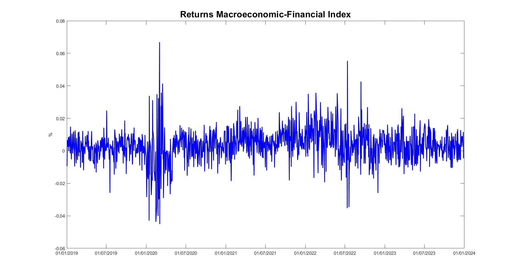

# Clustering and Macro-Financial Index

This section encompasses the construction of a macro-financial index and the application of clustering techniques on NASDAQ technology stocks.

## Overview

- **Clustering Analysis**: applies K-Means clustering on log returns of NASDAQ tech stocks to identify homogeneous groups.
- **Macro-Financial Index**: combines economic and financial indicators (e.g., VIX, CPI, GOLD) using volatility-based weights derived from GARCH models.

## File Structure

- `macro_financial_index.m`: MATLAB script for index construction.
- `cluster_analysis.py`: Python script for clustering analysis.

## 🖼️ Sample Output

  
  

