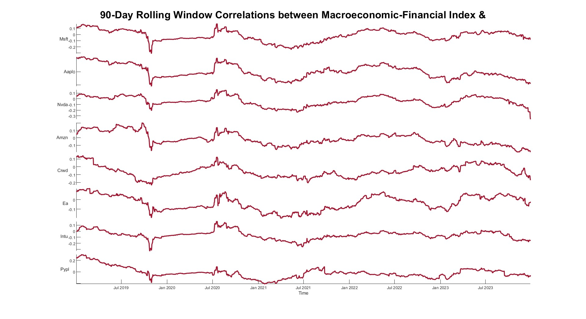
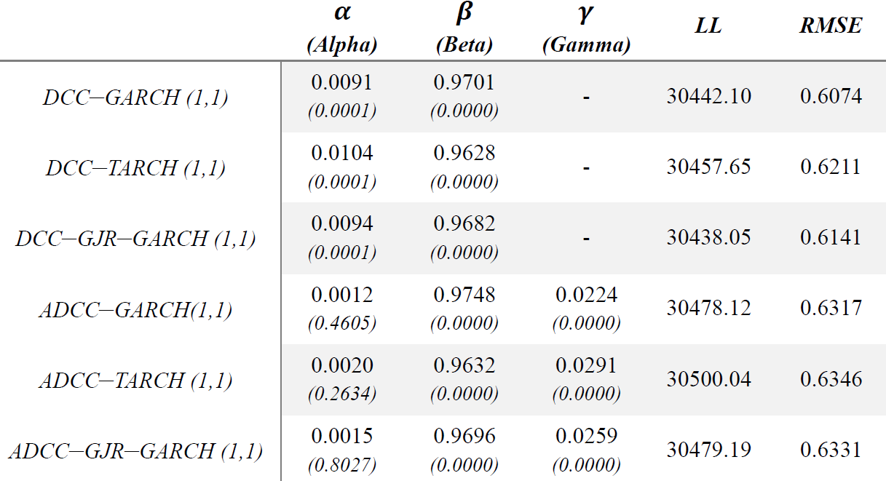
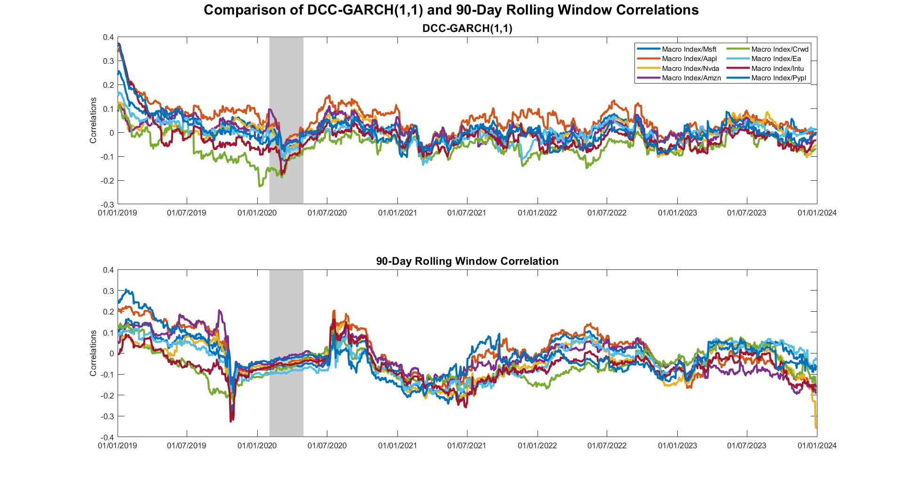
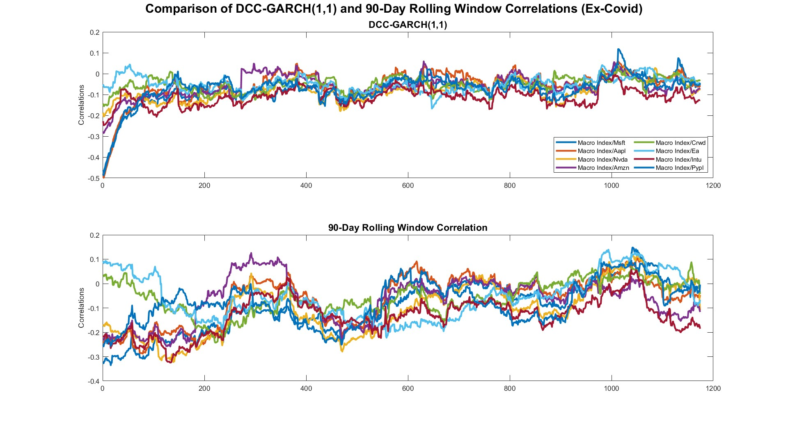

# DCC-GARCH Models

This section focuses on modeling dynamic correlations between the macro-financial index and asset returns using DCC-GARCH models.

## Overview

- **Rolling Correlation**: computes 90-day rolling correlations as a benchmark.
- **DCC-GARCH Models**: estimates various models to capture dynamic correlations.
- **VAR-DCC Comparison**: analyses models with and without conditional mean components.

## File Structure

- `dcc_main_driver.m`: main script for executing the complete workflow:
  - Step 1: initialization (`clear`, `clc`)
  - Step 2: rolling correlation benchmark → calls `dcc_compute_rolling.m`
  - Step 3: estimate all DCC-type models → runs `dcc_estimate_all_models.m`
  - Step 4: select best model by RMSE → uses `dcc_model_selection.m`
  - Step 5: compare best DCC vs. VAR-DCC → via `dcc_compare_with_VAR.m`
  - Step 6: generate plots → through `dcc_generate_plots.m`

## Toolbox Requirement

This section relies on the **MFE Toolbox** by Kevin Sheppard for DCC-GARCH model estimation.  
You can find the required function here:  
- [MFE Toolbox - dcc.m](https://github.com/bashtage/mfe-toolbox/blob/main/multivariate/dcc.m)

➡️ _Make sure to add the toolbox to the MATLAB path before running any script._

## Sample Output

  
   
  
   
  
   
  

## Ex-COVID Analysis

In addition to the full-sample analysis, we replicate the entire risk estimation pipeline by removing the months of February, March, and April 2020 to assess the robustness of results excluding extreme market conditions during the early pandemic phase:

  
   
  

