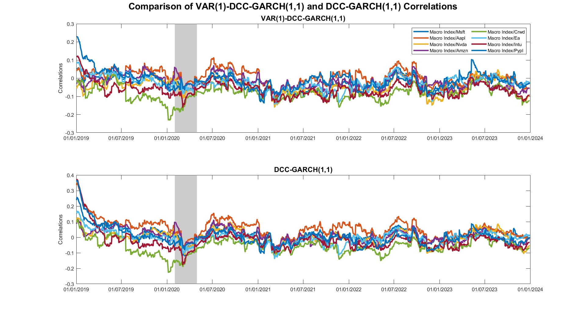

# DCC-GARCH Models

This section focuses on modeling dynamic correlations between the macro-financial index and asset returns using DCC-GARCH models.

## Overview

- **Rolling Correlation**: computes 90-day rolling correlations as a benchmark.
- **DCC-GARCH Models**: estimates various models to capture dynamic correlations.
- **VAR-DCC Comparison**: analyses models with and without conditional mean components.

## File Structure

- `dcc_main_driver.m`: main script for executing the complete workflow:
  - Step 1: initialization (`clear`, `clc`)
  - Step 2: rolling correlation benchmark → calls `dcc_compute_rolling.m`
  - Step 3: estimate all DCC-type models → runs `dcc_estimate_all_models.m`
  - Step 4: select best model by RMSE → uses `dcc_model_selection.m`
  - Step 5: compare best DCC vs. VAR-DCC → via `dcc_compare_with_VAR.m`
  - Step 6: generate plots → through `dcc_generate_plots.m`

## Toolbox Requirement

This section relies on the **MFE Toolbox** by Kevin Sheppard for DCC-GARCH model estimation.  
You can find the required function here:  
🔗 [dcc.m - MFE Toolbox](https://github.com/bashtage/mfe-toolbox/blob/main/multivariate/dcc.m)

➡️ **Make sure to add the toolbox to the MATLAB path before running any script.**

## Sample Output

  
   
  
   
  
   
  

