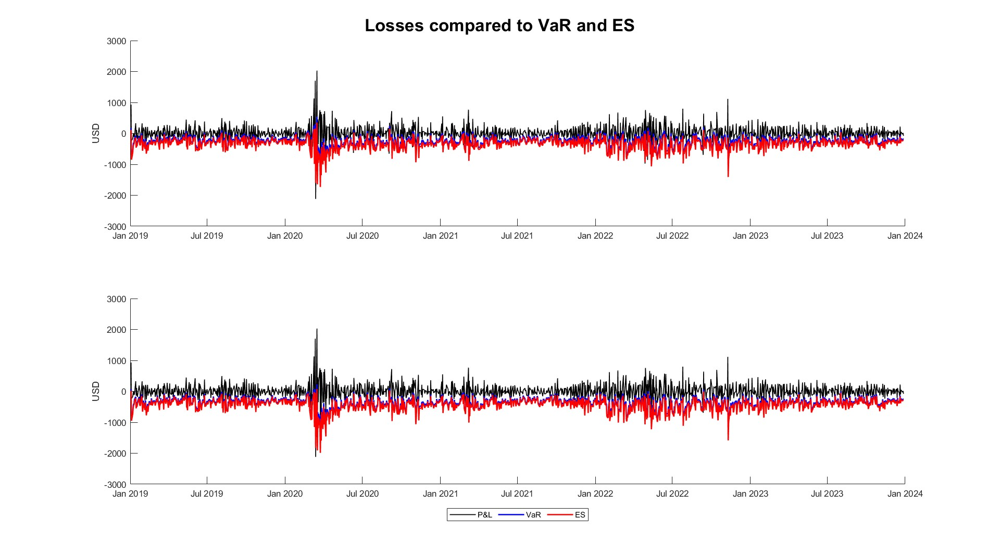
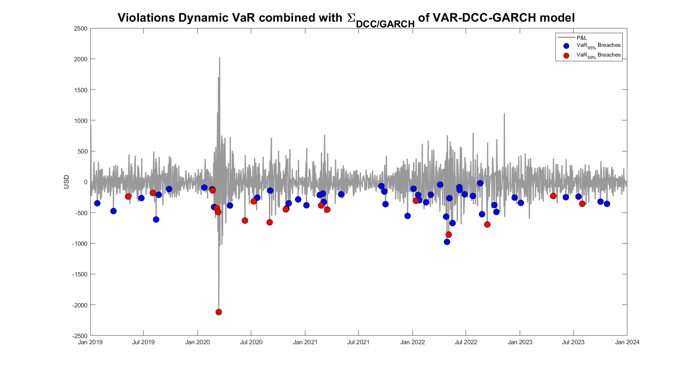

# Advanced Risk Management

This section extends the portfolio analysis with risk metrics, focusing on the _dynamic_ estimation of Value at Risk (VaR) and Expected Shortfall (ES) using a **parametric (or _variance–covariance_) approach** within a VAR(1)-DCC-GARCH(1,1) framework.

## Overview

- **Portfolio Construction**: builds an equally-weighted portfolio (without transaction costs) starting from a $10,000 allocation, adopting the Markowitz variance-covariance framework.
- **P&L Calculation**: computes daily profit & loss based on weighted returns.
- **Dynamic Risk Measures**: estimates VaR and ES at 5% and 1% significance using dynamic conditional covariance.

## File Structure

- `EW_portfolio.m`: creates an equally-weighted portfolio and computes daily P&L.
- `VaR_ES.m`: estimates _dynamic_ VaR and ES using VAR(1)-DCC-GARCH(1,1).
- `VaR_ES_breaches.m`: checks VaR and ES breaches and visualizes exceedances.

## Sample Output

  
   
  
   
  
   
  
   
  

